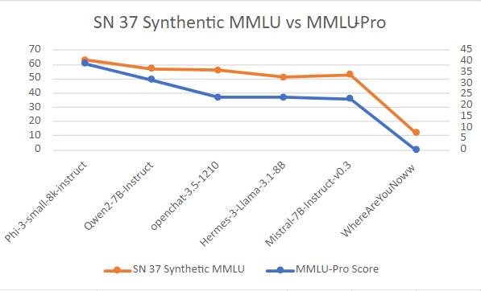

# Competitions

This page contains information about the current competitions.

## Competition 1: SN9_MODEL

Competition 1 is the OG competition for the finetuning subnet. 

### Goal

The purpose of this competition is to finetune the top models from the [pretraining subnet](https://www.macrocosmos.ai/sn9) to produce a chat bot.

### Evaluation

Models submitted to this competition are evaluated using a synthetically generated Q&A dataset from the [cortex subnet](https://github.com/Datura-ai/cortex.t). Specifically, models are evaluated based on their average loss of their generated answers. 

### Definitions

[Code Link](https://github.com/macrocosm-os/finetuning/blob/55b7ad0b9d532329c454cceed3f67e10696bae32/constants/__init__.py#L66)

## Competition 2: B7_MULTICHOICE

Competition 2 uses the same model requirements as competition 1, but introduces a new-and-improved evaluation function.

### Goal

The purpose of this competition is to finetune the top models from the [pretraining subnet](https://www.macrocosmos.ai/sn9) to produce a chat bot.

### Evaluation

Models submitted to this competition are evaluated using a synthetic MMLU-like dataset from the [Text Prompting subnet](https://www.macrocosmos.ai/sn1). This new dataset is a multiple choice dataset with a large array of multiple choice questions, spanning a domain of topics and difficulty levels, akin to MMLU. Currently, the dataset is generated using Wikipedia as the source-of-truth, though this will be expanded over time to include more domain-focused sources.

Our early testing of this dataset, shows promising correlation between this competition's evaluation function and the model performance on MMLU-pro, as shown by the graph below.

### Definitions

[Code Link](TODO: Fill in)